# Placement Preparation System
<p align="center">
  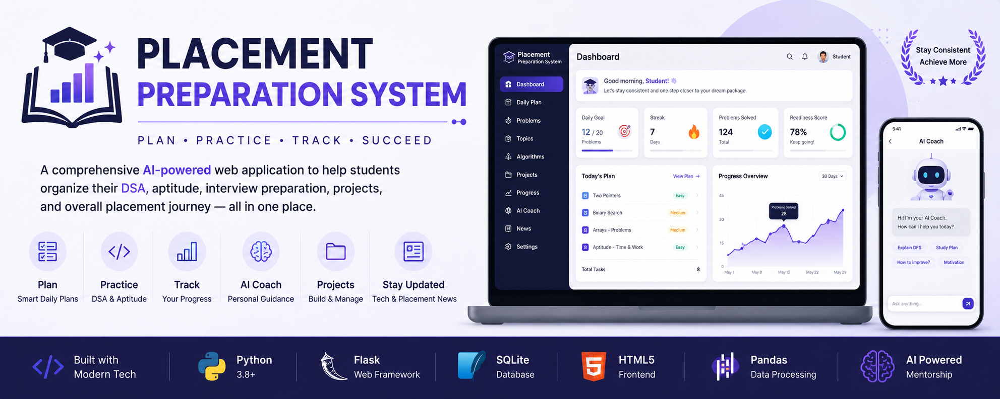
</p>

A comprehensive AI-powered web application that helps students organize, track, and manage their placement preparation from a single platform.

It combines DSA practice, aptitude, interview preparation, project tracking, Excel-based study planning, AI-powered mentoring, and progress analytics to help students stay consistent and placement-ready.

---
## Screenshots

### Dashboard
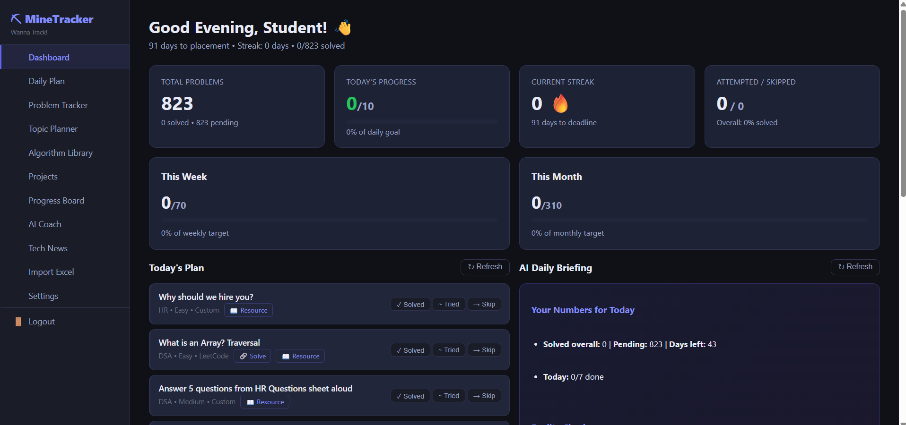

### Daily Plan
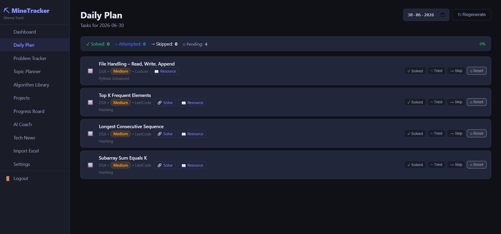

### Problem Tracker
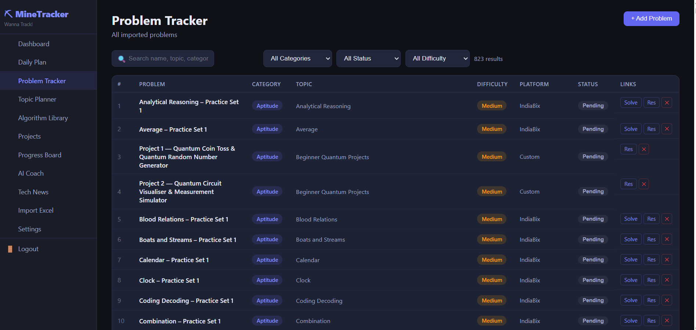

### Topic Planner
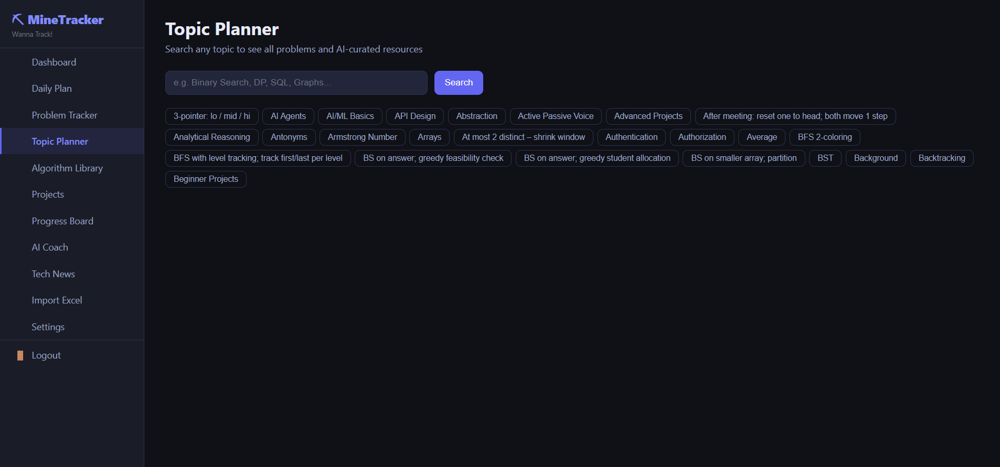

### Algorithm Library
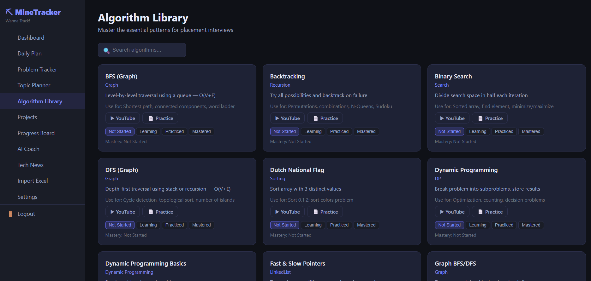

### AI Coach
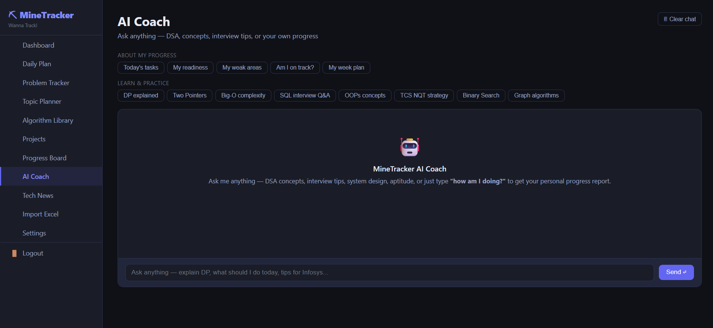

### Progress Board
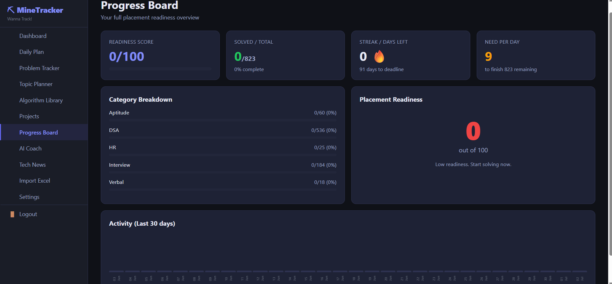

### Projects
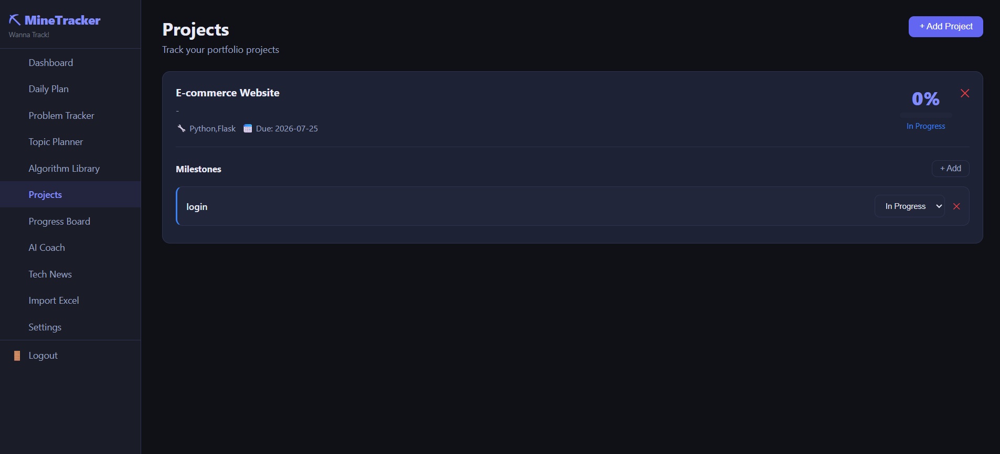

### Daily News
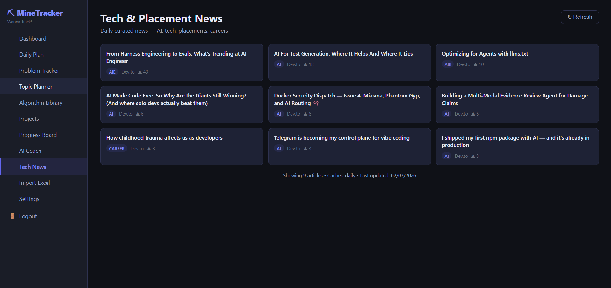

### Upload Planner
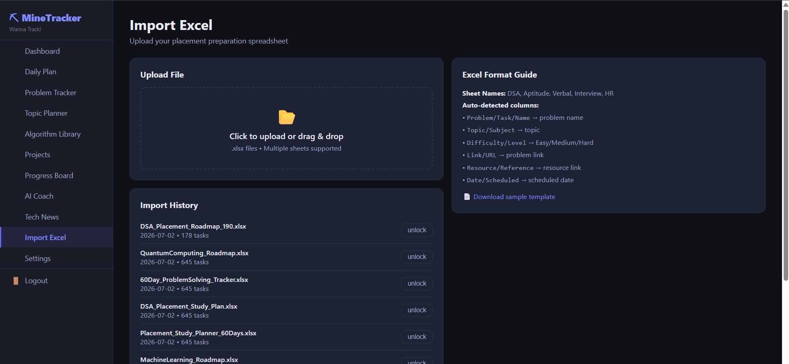

### Settings
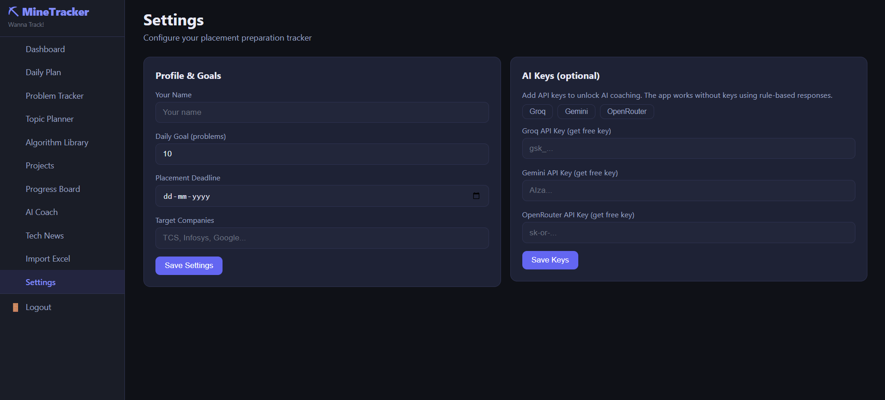

### Login
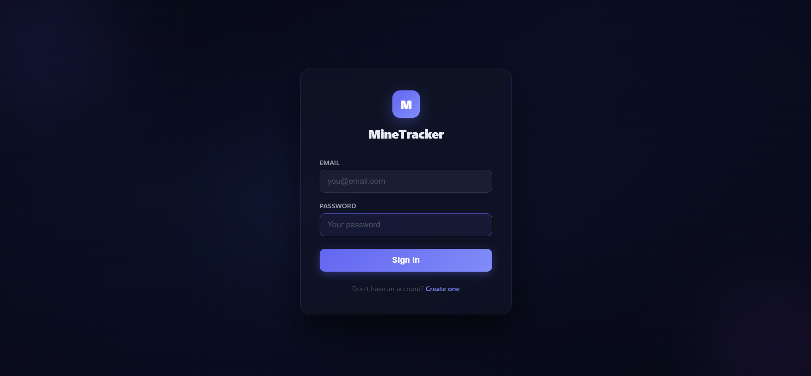

### Sign Up
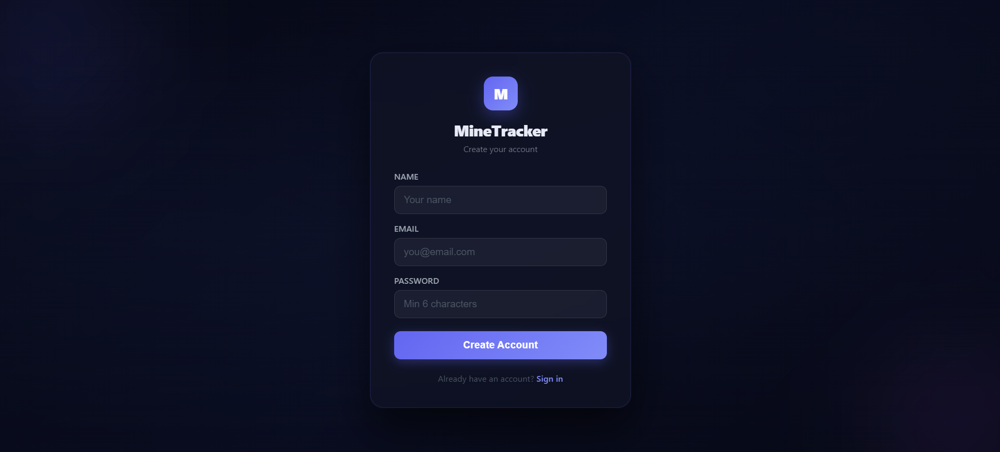

---

## Table of Contents

- [Features](#features)
- [Technology Stack](#technology-stack)
- [Installation](#installation)
- [Configuration](#configuration)
- [Usage](#usage)
- [API Endpoints](#api-endpoints)
- [Database Schema](#database-schema)
- [Contributing](#contributing)
- [License](#license)

---

## Features

| Feature | Description |
|---------|-------------|
| Authentication | Secure signup and login with isolated user data |
| Dashboard | Daily progress, streaks, goals, and AI-generated briefing |
| Daily Plan | Automatically generated study plan from imported Excel schedules |
| Problem Tracker | Track DSA, Aptitude, SQL, Verbal, Interview, and HR questions |
| Topic Planner | Browse topics with curated learning resources |
| Algorithm Library | DSA pattern library with mastery tracking |
| Project Management | Track projects, milestones, and completion progress |
| Progress Analytics | Readiness score, category analysis, and activity charts |
| AI Coach | Personalized placement guidance using AI |
| Tech & Placement News | Daily technology and placement-related updates |
| Excel Import | Import and organize preparation plans from Excel |
| Settings | Manage profile, goals, deadlines, and AI providers |

---

## Technology Stack

| Layer       | Technology                                    |
|-------------|-----------------------------------------------|
| Backend     | Python 3.8+ / Flask                           |
| Database    | SQLite (with `sqlite3` module)                |
| Frontend    | Vanilla HTML/CSS/JS (single‑page app)         |
| AI APIs     | Groq, Google Gemini, OpenRouter (optional)    |
| Excel Parsing | Pandas + openpyxl                           |
| Web Scraping| DuckDuckGo Search, feedparser, requests       |
| Auth        | Werkzeug (password hashing, sessions)         |

---

## Installation

### 1. Clone the repository
```bash
git clone https://github.com/yourusername/placement-preparation-system.git
cd placement-preparation-system
```

### 2. Create a virtual environment (recommended)
```bash
python -m venv venv
source venv/bin/activate       # On Windows: venv\Scripts\activate
```

### 3. Install dependencies
```bash
pip install -r requirements.txt
```
If you encounter issues with `duckduckgo-search`, install it separately:
```bash
pip install duckduckgo-search
```

### 4. Run the application
```bash
python app.py
```

The app will create a SQLite database (`app.db`) automatically on first run.

### 5. Open your browser
Visit `http://localhost:5000`. You will be redirected to the login page.

---

## Configuration

All configuration is stored in the `settings` table (per user) and can be updated via the **Settings** page in the UI.

### Environment Variables (optional)
None are required; the app uses a default secret key. For production, set:
```bash
export SESSION_SECRET="your-strong-secret-key"
```

### AI Providers (optional)
- **Groq** – get a free key at [console.groq.com](https://console.groq.com)
- **Gemini** – get a free key at [aistudio.google.com](https://aistudio.google.com)
- **OpenRouter** – get a key at [openrouter.ai](https://openrouter.ai)

If no API key is provided, the app falls back to rule‑based responses.

### Default Settings (created on signup)
| Setting              | Default        |
|----------------------|----------------|
| `name`               | "Student"      |
| `daily_goal`         | 10             |
| `placement_deadline` | 2026-10-01     |
| `ai_provider`        | groq           |

---

## Usage

### First‑time Setup
1. **Sign up** with your email and password.
2. **Import your Excel sheet** (see [Excel Format](#excel-format)).
3. The **Daily Plan** will be populated with tasks that have a `scheduled_date` matching today (or any date you pick).
4. Use the **Dashboard** to monitor progress.

### Excel Format
The importer automatically detects column names. Supported headers:
- **Problem Name** – `Problem`, `Task`, `Name`, `Title`, `Question`
- **Topic** – `Topic`, `Subject`, `Concept`
- **Category** – auto‑detected from sheet name or column: `DSA`, `Aptitude`, `Verbal`, `Interview`, `HR`
- **Difficulty** – `Easy`, `Medium`, `Hard` (or `High`, `Low`)
- **Problem Link** – `Link`, `URL`, `Problem Link`
- **Resource Link** – `Resource`, `Reference`, `Article`
- **Scheduled Date** – `Date`, `Due`, `Scheduled` (any date format parsable by Pandas)

Sheets named `DSA`, `LeetCode`, `Coding` → category `DSA`; `Aptitude`, `Quant` → category `Aptitude`; etc.

### Daily Plan Logic
- The plan shows **all pending problems** whose `scheduled_date` matches the selected date.
- It is **auto‑generated** the first time you view a date – no manual refresh needed.
- Click **Regenerate** to rebuild the plan (useful after adding new problems).

### Statuses
- **Pending** – not started
- **Solved** – completed
- **Attempted** – tried but not solved
- **Skipped** – skipped for now

Clicking a status button cycles through the four states.

---

## API Endpoints

All endpoints (except auth) require a valid session cookie.

| Method | Endpoint                     | Description |
|--------|------------------------------|-------------|
| POST   | `/api/auth/signup`           | Create a new account |
| POST   | `/api/auth/login`            | Log in |
| GET    | `/logout`                    | Clear session and redirect to login |
| GET    | `/api/dashboard`             | Dashboard data (stats, plan, AI briefing) |
| GET    | `/api/daily-plan`            | Plan for a given date (auto‑generates) |
| POST   | `/api/daily-plan/refresh`    | Regenerate plan for a date |
| PUT    | `/api/daily-plan/<id>`       | Update status of a plan item |
| GET    | `/api/problems`              | List problems with filters |
| POST   | `/api/problems`              | Add a single problem |
| PUT    | `/api/problems/<id>`         | Update problem status |
| DELETE | `/api/problems/<id>`         | Delete a problem |
| GET    | `/api/categories`            | Category breakdown |
| GET    | `/api/topics`                | List all distinct topics |
| GET    | `/api/topic?name=`           | Problems + resources for a topic |
| GET    | `/api/algorithms`            | List all algorithms |
| PUT    | `/api/algorithms/<id>`       | Update mastery level |
| GET    | `/api/projects`              | List projects + milestones |
| POST   | `/api/projects`              | Create a project |
| PUT    | `/api/projects/<id>`         | Update project |
| DELETE | `/api/projects/<id>`         | Delete project |
| POST   | `/api/upload`                | Upload and parse Excel file |
| POST   | `/api/import`                | Import parsed tasks into the database |
| POST   | `/api/ai/coach`              | Send a message to the AI coach |
| POST   | `/api/ai/briefing`           | Generate daily briefing |
| GET    | `/api/news`                  | Fetch daily tech news |
| GET    | `/api/settings`              | Get user settings |
| POST   | `/api/settings`              | Update settings |

Full API details are documented in the source code (Flask routes in `app.py`).

---

## Database Schema

The database consists of the following main tables:

- **users** – id, username, email, password_hash, created_at
- **problems** – id, user_id, name, category, topic, difficulty, platform, problem_link, resource_link, status, scheduled_date, import_batch, notes
- **daily_plan** – id, user_id, plan_date, problem_id, order_index, status
- **daily_log** – id, user_id, log_date, problems_solved, problems_attempted, problems_skipped, problems_target, study_hours, mood, notes
- **projects** – id, user_id, name, description, tech_stack, target_date, status, github_link, completion_pct
- **milestones** – id, project_id, name, description, deadline, status, order_index
- **algorithms** – id, name, pattern, description, when_to_use, youtube_link, article_link, mastery, solved_problems
- **imports** – id, user_id, filename, import_date, total_imported, category, protected
- **ai_feedback** – id, user_id, feedback_date, feedback_type, content, model_used
- **settings** – user_id (PK), key, value

All user‑specific tables have a `user_id` foreign key.

---

## Contributing

Contributions are welcome! Please follow these steps:

1. Fork the repository.
2. Create a new branch for your feature (`git checkout -b feature/amazing-feature`).
3. Commit your changes (`git commit -m 'Add some amazing feature'`).
4. Push to the branch (`git push origin feature/amazing-feature`).
5. Open a Pull Request.

Please ensure your code follows PEP 8 style and includes appropriate comments.

---

## License

This project is licensed under the MIT License – see the [LICENSE](LICENSE) file for details.

---

## Acknowledgements

- [Flask](https://flask.palletsprojects.com/)
- [Pandas](https://pandas.pydata.org/)
- [Groq](https://groq.com/) / [Gemini](https://ai.google.dev/) / [OpenRouter](https://openrouter.ai/)
- [DuckDuckGo Search](https://pypi.org/project/duckduckgo-search/)
- [Feedparser](https://pythonhosted.org/feedparser/)
- All open‑source libraries used

---

## Author

**Praveena R**

B.E.(CSE)

GitHub: https://github.com/rppraveena

---

Built to simplify placement preparation through intelligent planning, progress tracking, and AI-powered assistance.
